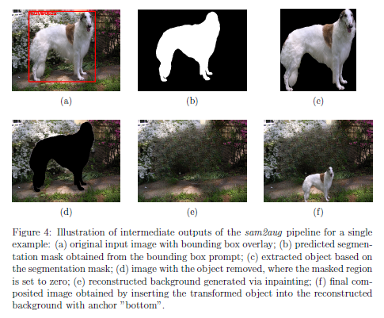
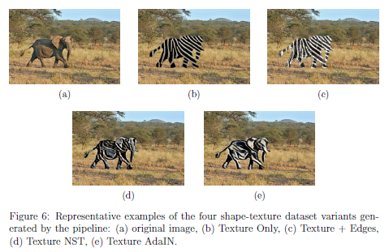
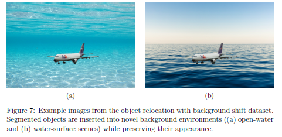
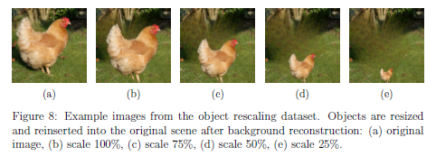

# sam2aug

`sam2aug` is a modular object-centric image augmentation framework developed for controlled robustness experiments on image classification models.

The pipeline combines:

- **segmentation** with **SAM2**
- **background reconstruction** with **LaMa**
- **object transformation and relocation**

It was evaluated during the experiments accompanying master thesis, with a focus on three controlled transformations:

- **shape–texture manipulations**
- **object relocation with background shift**
- **object rescaling on reconstructed backgrounds**

---

## Read this first

Before installing or running anything, read these files in the following order:

1. **`SETUP.md`**  
   Environment setup, external dependencies, editable installs, required environment variables, and troubleshooting.

2. **`PROJECT_STRUCTURE.md`**  
   Detailed repository structure and the relationship between pipeline code, datasets, experiments, and outputs.

3. **`sam2aug/config.py`**  
   Central configuration for paths, model access, and shared settings.

If you only want the shortest path to a working installation, start with **`SETUP.md`**.

---

## Repository overview

```text
sam2aug/
├── sam2aug/          # Core augmentation pipeline
├── datasets/         # Curated inputs, manifests, donor images, generated outputs
├── experiments/      # Dataset generation and evaluation scripts
├── notebooks/        # Analysis and plotting notebooks
│
├── SETUP.md
├── PROJECT_STRUCTURE.md
├── setup.py
├── pyproject.toml
└── sam2aug/config.py
```

### Core package

The core implementation lives in `sam2aug/`:

- `pipeline.py` — orchestrates segmentation, extraction, inpainting, augmentation, and relocation
- `segmenter.py` — SAM2-based object segmentation
- `postprocessor.py` — object extraction and source-with-hole creation
- `inpainter.py` / `lama_inpaint.py` — LaMa-based background reconstruction
- `relocator.py` — object transformation, scaling, placement, and blending


## Installation summary

The detailed version is in `INSTALL.md`. The short version is:

### 1. Python and environment

The codebase was developed and tested with:

- Python 3.10.19
- PyTorch 2.9.0 (CUDA 13.0, cu130)
- torchvision 0.24.0 (cu130)
- NVIDIA CUDA runtime 13.0
### 2. Install `sam2aug`

Run this from the repository root:

```bash
git clone https://github.com/roza-gaisina/sam2aug.git 
cd sam2aug
pip install -e .
```

### 3. Install external dependencies

- **SAM2** should be installed from its own repository
- **LaMa** must be available on `PYTHONPATH`:

```bash
export LAMA_HOME=/path/to/lama
export PYTHONPATH=$LAMA_HOME:$PYTHONPATH
```

### 4. Set environment variables

```bash
export SAM2_HOME=/path/to/sam2_repo
export LAMA_HOME=/path/to/lama
export SAM2AUG_OUTPUT_DIR=/path/to/output_dir
export PYTHONPATH=$SAM2_HOME:$LAMA_HOME:$PYTHONPATH
```

### 5. Verify imports

```bash
python -c "import sam2aug; print(sam2aug.__file__)"
python -c "from sam2aug import AugmentationPipeline, Segmenter, LamaInpainter; print('imports ok')"
python -c "from saicinpainting.evaluation.utils import move_to_device; print('LaMa import ok')"
python -c "import sam2; print(sam2.__file__)"
```

---

## Example outputs

Below are representative examples used in the thesis.  

### Intermediate pipeline outputs

This figure illustrates the main intermediate outputs of the pipeline for a single example:

- original image with bounding box
- predicted segmentation mask
- extracted object
- image with removed object
- inpainted background
- final composited image

**X:** `docs/images/sam2aug_steps.png`

```md

```

### Shape–texture dataset variants

Representative examples of the shape–texture dataset variants:

- original image
- Texture Only
- Texture + Edges
- Texture NST
- Texture AdaIN

**X:** `docs/images/shape_texture.png`

```md

```

### Object relocation with background shift

Examples from the relocation dataset with novel backgrounds.

**X:** `docs/images/background_shift.png`

```md

```

### Object rescaling

Examples from the object rescaling dataset.

**X:** `docs/images/object_rescale.png`

```md

```